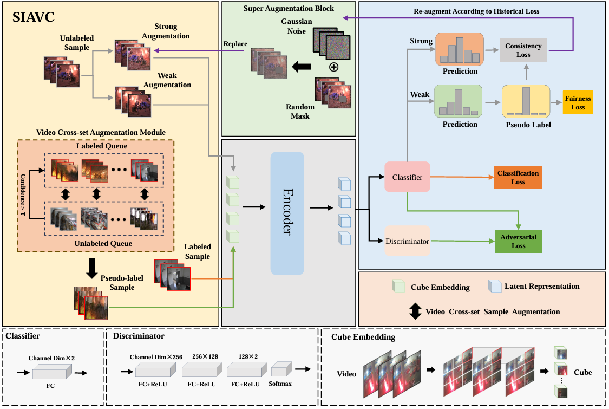
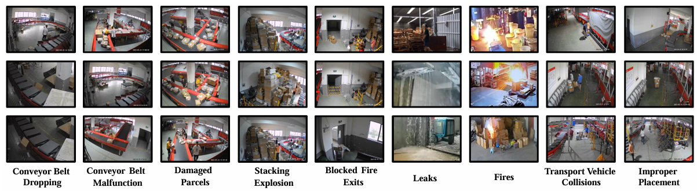

# SIAVC
SIAVC: Semi-Supervised Framework for Industrial Accident Video Classification

我们提供了一个用于工业事故视频分类的半监督算法。

[2025/12/1] Fixed the part of the code that caused model training to crash.

<p align="center">
  
</p>

# Dataset
The ECA9 dataset is released at [Baidu Cloud]( https://pan.baidu.com/s/1acHbQiuaPE1DZtBsyxibzQ?pwd=vrea) or [Google Drive](https://drive.google.com/drive/folders/1GOhSjRL5jgZ3S2-T25PeCQZ4CVXuz1Lg?usp=drive_link). 


<p align="center">
  
</p>

You can update your own data as:
```
/dataset 
  /dataset's name 
    /train
      /class1
        11.mp4 or 11.mp4.pkl
        ...
      /class2
        21.mp4 or 21.mp4.pkl
        ...
      ...
    /test
      /class1
        111.mp4 or 111.mp4.pkl
        ...
      /class2
        211.mp4 or 211.mp4.pkl
        ...
      ...

```    

# Train

SIAVC.py contains code for training and testing.

SIAVC.py 中已经包含了训练以及测试的代码，设置好数据集路径之后运行即可。

```
run SIAVC.py
```

# Citation
If you use this code for your research, please cite our [paper](https://ieeexplore.ieee.org/abstract/document/10741535).
```
@ARTICLE{10741535,
  author={Li, Zuoyong and Lin, Qinghua and Fan, Haoyi and Zhao, Tiesong and Zhang, David},
  journal={IEEE Transactions on Circuits and Systems for Video Technology}, 
  title={SIAVC: Semi-Supervised Framework for Industrial Accident Video Classification}, 
  year={2025},
  volume={35},
  number={3},
  pages={2603-2615},
  doi={10.1109/TCSVT.2024.3490597}}
```
